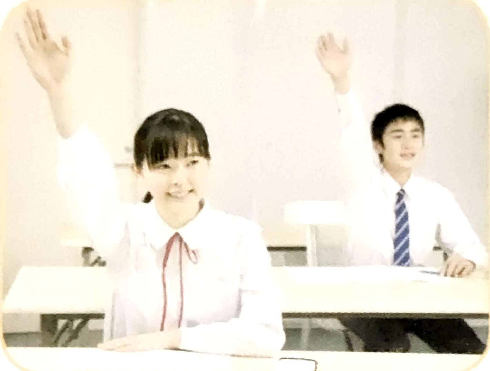
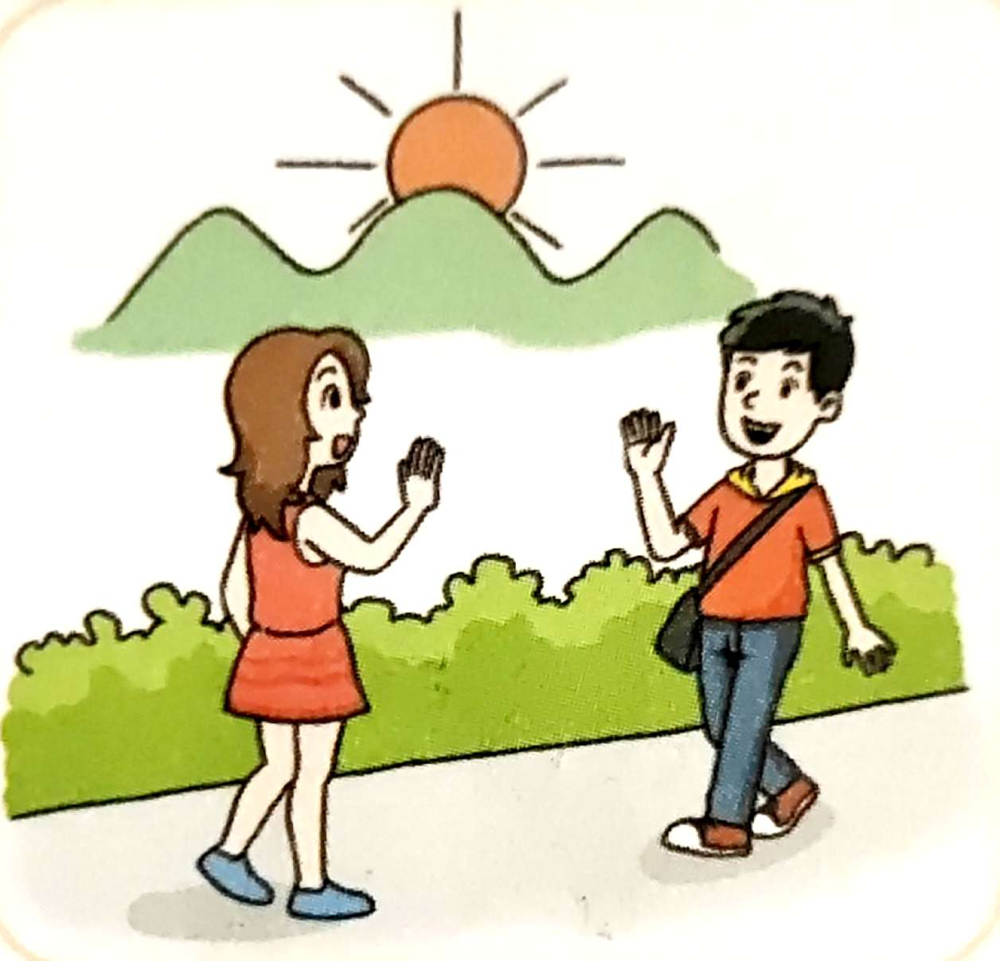
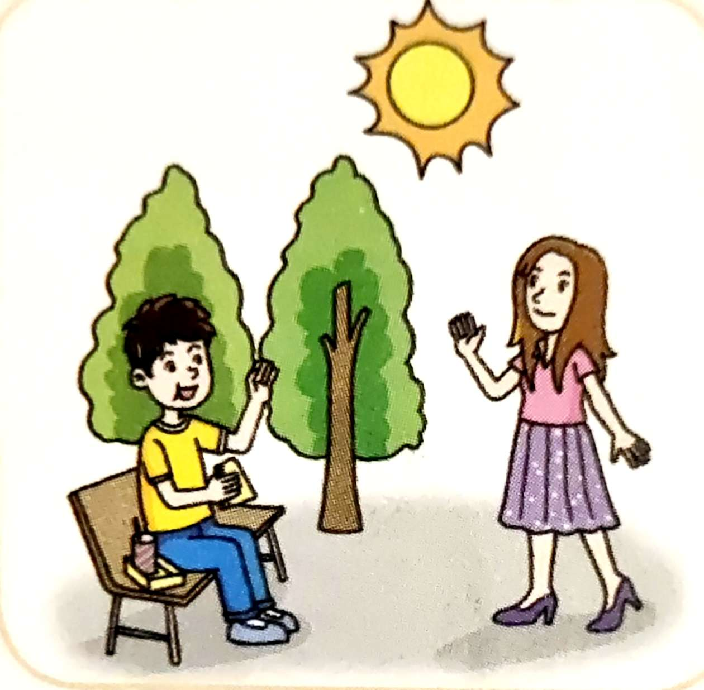
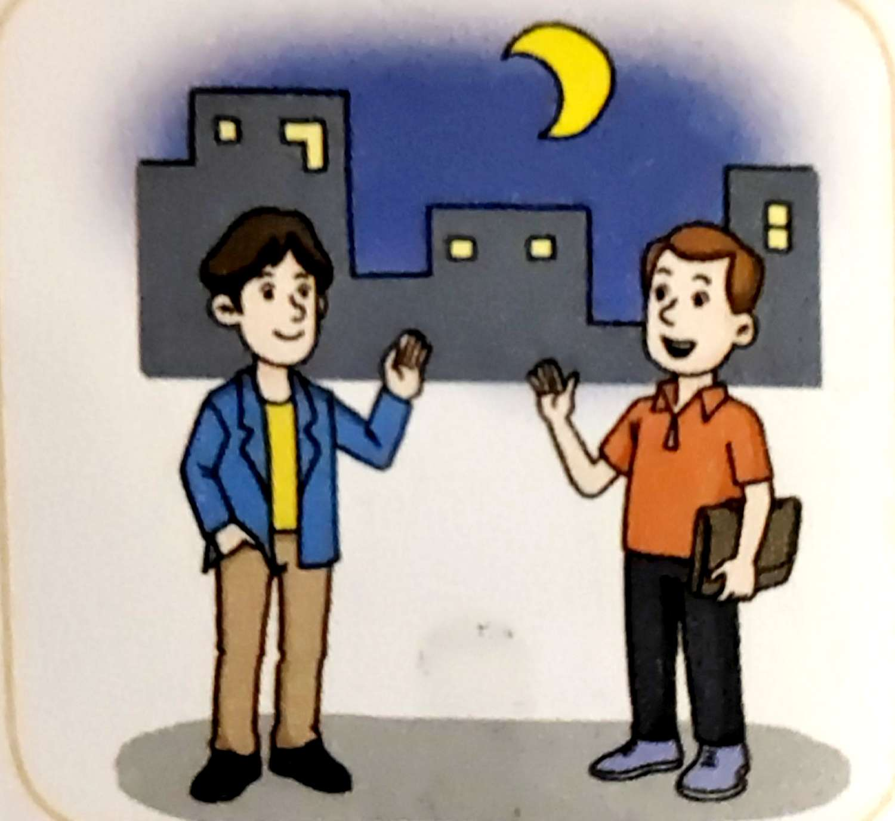
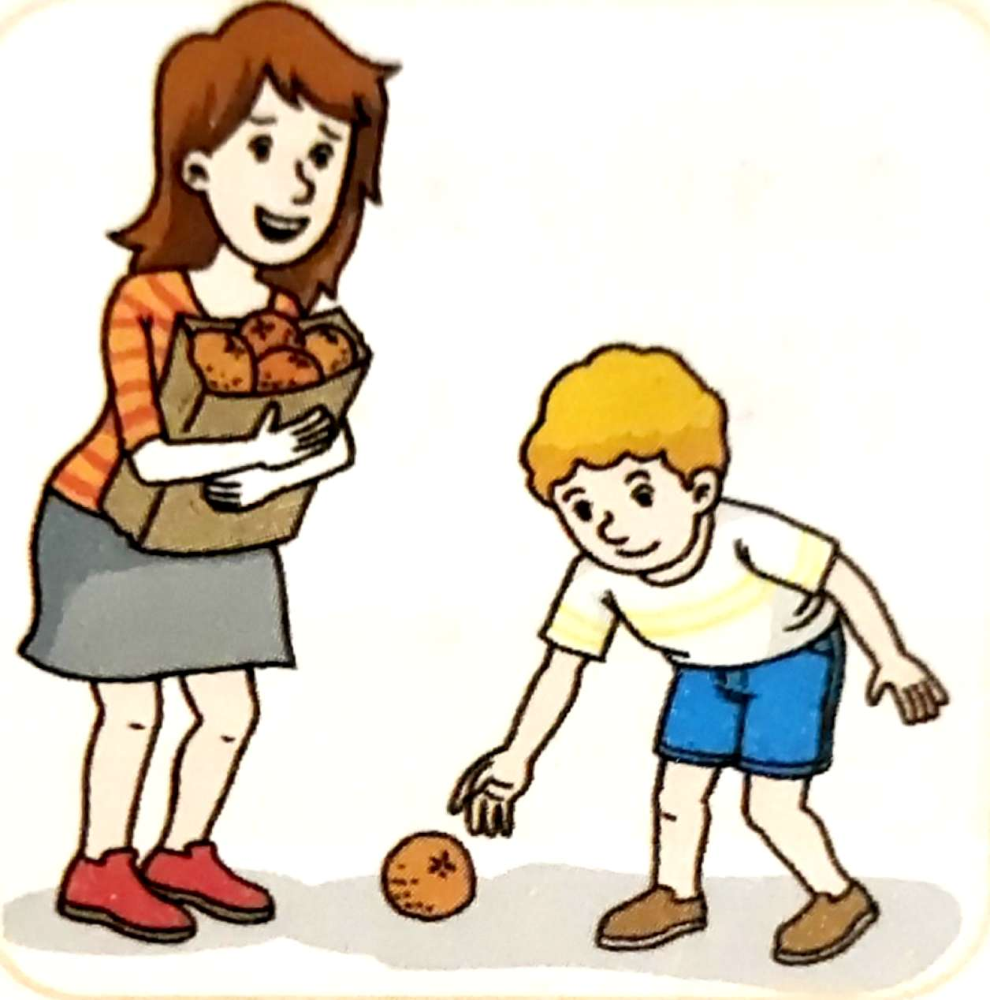
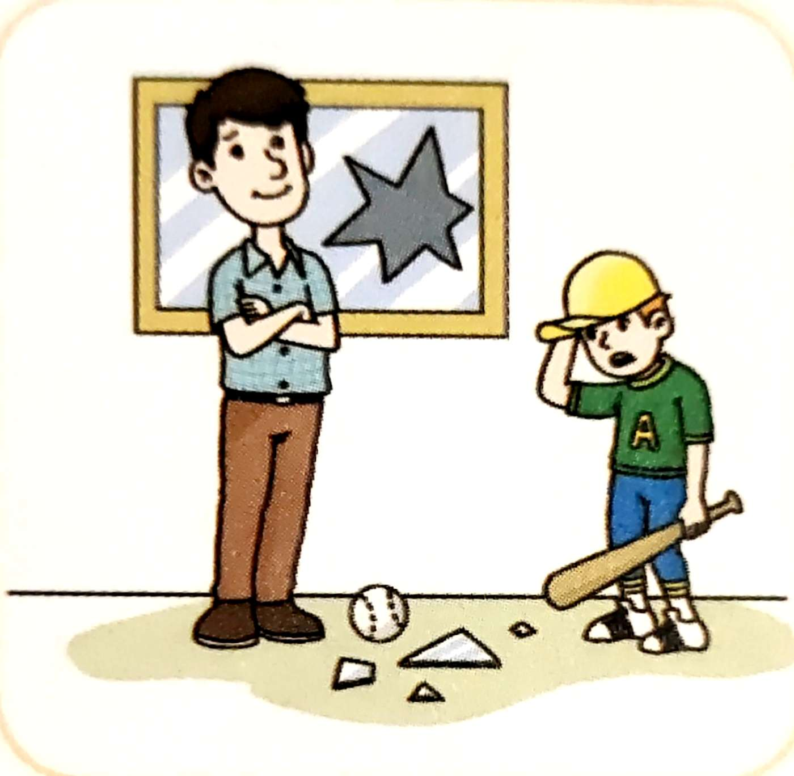
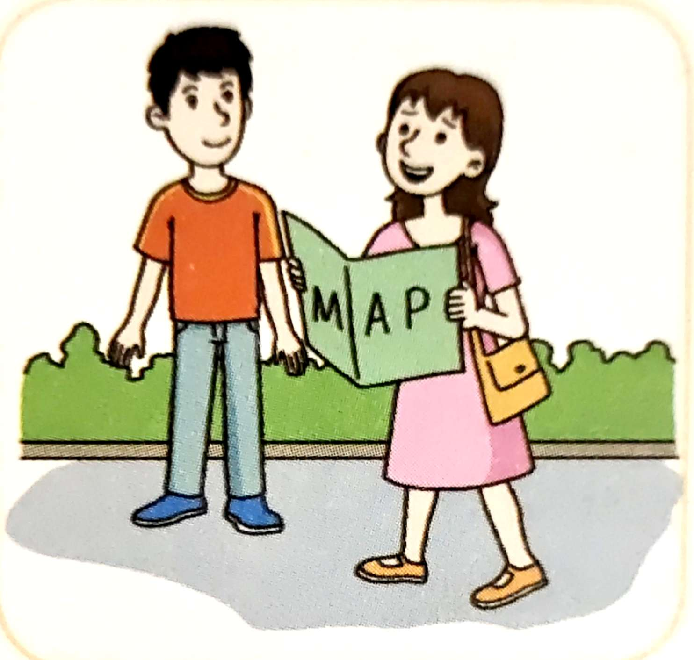

---
# try also 'default' to start simple
theme: seriph
# random image from a curated Unsplash collection by Anthony
# like them? see https://unsplash.com/collections/94734566/slidev
background: https://source.unsplash.com/collection/94734566/1920x1080
# apply any windi css classes to the current slide
class: 'text-center'
# https://sli.dev/custom/highlighters.html
highlighter: shiki
# show line numbers in code blocks
lineNumbers: false
# some information about the slides, markdown enabled
info: |
  ## Japanese Conversation
  Presentation slides for Japanese beginners.

  Learn more at [Japanese Conversation](https://jp-conv.netlify.app)
# persist drawings in exports and build
drawings:
  persist: false
---

# わかって話す日本語

<ruby>王<rt>おう</rt></ruby>

  
    Space を押して、次のページへ <carbon:arrow-right class="inline"/>
  

  <button @click="$slidev.nav.openInEditor()" title="Open in Editor" class="text-xl icon-btn opacity-50 !border-none !hover:text-white">
    <carbon:edit />
  </button>
  <a href="https://github.com/jyboy/japanese_conversation" target="_blank" alt="GitHub"
    class="text-xl icon-btn opacity-50 !border-none !hover:text-white">
    <carbon-logo-github />
  </a>

---

# 0 はじめまして

【問題１】<ruby>授業<rt>じゅぎょう</rt></ruby>の中で使う<ruby>言葉<rt>ことば</rt></ruby>です。先生が<ruby>質問<rt>しつもん</rt></ruby>した時、学生は何と言いますか。

(1)
先生：わかりますか。
学生：はい、(&nbsp;&nbsp;&nbsp;&nbsp;)

 

(2)
先生：わかりますか。
学生：いいえ、(&nbsp;&nbsp;&nbsp;&nbsp;)

---

# 0 はじめまして

【問題２】<ruby>挨拶<rt>あいさつ</rt></ruby>のことばを練習しましょう。次の<ruby>場面<rt>ばめん</rt></ruby>で何と言いますか。

(1) (&nbsp;&nbsp;&nbsp;&nbsp;)

(2) (&nbsp;&nbsp;&nbsp;&nbsp;)

(3) (&nbsp;&nbsp;&nbsp;&nbsp;)

(4) (&nbsp;&nbsp;&nbsp;&nbsp;)

(5) (&nbsp;&nbsp;&nbsp;&nbsp;)

(6) (&nbsp;&nbsp;&nbsp;&nbsp;)

---

# 0 はじめまして

次のモデル会話を使って、<ruby>自己<rt>じこ</rt></ruby><ruby>紹介<rt>しょうかい</rt></ruby>をしましょう。

はじめまして。①<u>＜名前＞</u>です。②<u>＜名前（日本語での読み方）＞</u>と読んでください。③<u>＜<ruby>所属<rt>しょぞく</rt></ruby>＞</u>です。④<u>＜<ruby>出身地<rt>しゅっしんち</rt></ruby>＞</u>のしゅっしんです。どうぞよろしくおねがいします。

例：
① <ruby>劉<rt>りゅう</rt></ruby>
② りゅう
③ 社員
④ <ruby>洛陽<rt>らくよう</rt></ruby>

あなた：
① 王
② おう
③ 社員
④ 洛陽

---

# 1 ご家族は何人ですか。

続く
